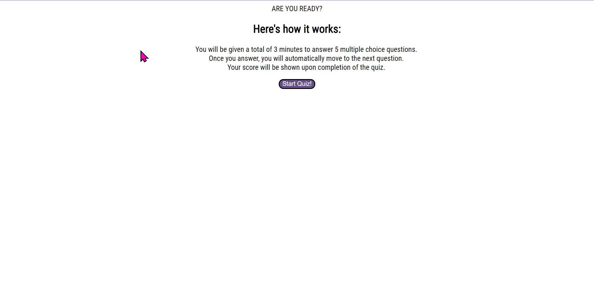

# Timed-Coding-Assessment
Timed coding quiz

## Description
This project was created to test future web developers on their existing coding knowledge. The subject of coding is incredibly robust and requires a lot of knowledge and practice. When you're interviewing for your first position as a web developer, you may find that you're required to take an assessment, similar to the one provided, in order to move forward in the interview process. Throughout coding this project, I learned how to tackle many bugs that arise when you're coding in JavaScript and how to correct them by reading my browser's console log. I also learned how to create a fairly lengthy function, containing multiple steps, variables, loops and if statements, all to reach the goal of automatically cycling through a large object.

## Installation

To view this project, it required that a browser be installed on your preferred device. The browser can be any one of your choosing. To view, enter the following URL to the address bar of said browser:

https://tinathedev91.github.io/Timed-Coding-Assessment/

## Usage

When viewing the website, it should resemble the following image. Included is a screenshot of how it should look in your desired web browser. If you have any issues viewing, please contact me via email at TinaTheDev91@gmail.com

## Credits and Mentions

Thank you to my instructor Suarav for teaching us JavaScript fundamentals.

Thank you to my tutor, Jossy Olea with the assistance in debugging my code.